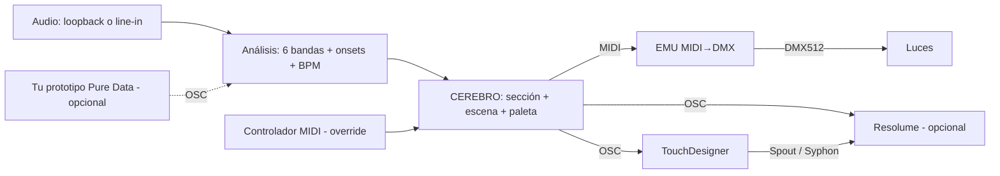

# AVI — Plan del MVP

**AVI** = un solo "cerebro" que escucha la música, la separa por bandas de frecuencia
y decide, de forma autónoma, qué hacen las luces (vía MIDI → EMU → DMX) y qué hacen
los visuales (TouchDesigner, y opcionalmente Resolume), con los mismos colores y el
mismo pulso.

---

## 1. Qué cuenta como "MVP terminado"

El MVP está hecho cuando, con una canción sonando en tu computador:

1. Las luces reaccionan por banda (bombo, bajo, voces, hats…) a través de tu EMU.
2. TouchDesigner muestra **3 escenas** que reaccionan a las mismas bandas.
3. Luces y visuales usan **la misma paleta de color** en todo momento.
4. El cerebro **cambia de escena y paleta solo** cuando la canción cambia de sección
   (intro → build → drop → break), alineado al compás.
5. Un controlador MIDI puede **forzar** escena / paleta / blackout (override manual).

Latencia objetivo audio → luz: **< 50 ms** percibidos.

> Supuesto: "que actúe como el DJ" = reaccionar y dirigir el show sobre la música
> que ya suena. Elegir o mezclar canciones queda fuera del MVP (ver §9).

---

## 2. Decisiones tomadas

| Decisión | Elegido | Por qué |
|---|---|---|
| Lenguaje del cerebro | **Python 3.11** | Se puede escribir y **probar en cloud** con audio sintético; tiene librerías maduras para MIDI (`mido`) y OSC (`python-osc`). Un patch de Pd no se puede testear aquí. |
| Tu prototipo Pure Data | **Entrada opcional** | Si quieres reutilizarlo, que mande OSC al cerebro (`/pd/band/*`). Ver `puredata/README.md`. |
| Análisis de audio | FFT propia con `numpy` | Sin dependencias difíciles de instalar en Windows. `aubio` queda como mejora. |
| Salida a luces | **MIDI → EMU → DMX** | Es el hardware que tienes. La tabla exacta nota/CC → canal DMX se descubre en la fase local L2. |
| Salida a TouchDesigner | **OSC** (+ MIDI espejo) | OSC lleva floats 0–1 con nombre (`/avi/band/kick`), más preciso que MIDI (0–127). El MIDI espejo queda para software de DJ/VJ. |
| TouchDesigner → Resolume | Video por **Spout** (Win) / **Syphon** (Mac); cambios de clip por OSC desde el cerebro | Resolume es opcional (de pago); el MVP funciona sin él. |
| Red de TouchDesigner | Generada por **script Python** que corres dentro de TD | Un `.toe` es binario; un script se versiona y se escribe en cloud. |

---

## 3. Arquitectura



**La clave del "un solo cerebro":** cada ~10 ms el cerebro produce un único
`ShowState`. Luces, TouchDesigner y Resolume solo *traducen* ese estado; ninguno
decide nada por su cuenta. Así es imposible que se desincronicen los colores.

```json
{
  "t": 123.456,
  "bpm": 126.0, "beat": 3, "bar": 17, "phrase_pos": 0.25,
  "section": "drop",
  "scene": 2,
  "palette": [[1.0, 0.1, 0.4], [0.1, 0.3, 1.0], [1.0, 1.0, 1.0]],
  "bands":  {"sub": 0.8, "kick": 0.95, "lowmid": 0.4, "mid": 0.3, "highmid": 0.2, "high": 0.6},
  "onsets": {"kick": true, "highmid": false, "high": true},
  "override": null
}
```

Módulos (una carpeta por fase, ver `avi/`):

| Módulo | Hace | Fase |
|---|---|---|
| `avi/audio` | Captura, FFT, energía por banda, onsets, BPM | F1 |
| `avi/brain` | Detecta sección, elige escena y paleta, produce `ShowState` | F2 |
| `avi/outputs` | `ShowState` → MIDI (EMU), OSC (TD), OSC (Resolume) | F3 |
| `avi/control` | Controlador MIDI de entrada → overrides | F4 |
| `touchdesigner/` | Script que construye la red de TD | F5 |

---

## 4. Mapeo banda → luz → TouchDesigner

Valores por defecto (editables en `config/bands.yaml` y `config/show.example.yaml`).

| Banda | Hz | Instrumento aprox. | Luces (DMX) | TouchDesigner |
|---|---|---|---|---|
| `sub` | 20–60 | 808, sub-bass | Dimmer base de todas (respira) | Escala / deformación lenta |
| `kick` | 60–150 | Bombo | Flash de dimmer en PARs frontales | Pulso de zoom + feedback |
| `lowmid` | 150–400 | Bajo, cuerpo | Desplaza el tono dentro de la paleta | Amplitud del ruido / desplazamiento |
| `mid` | 400–2k | Voces, synths | Canal blanco (W) / intensidad secundaria | Brillo, densidad de partículas |
| `highmid` | 2k–6k | Snare, clap | Strobe corto (solo en `drop`) | Glitch / corte de cámara |
| `high` | 6k–16k | Hats, platos | Chase entre luces | Chispas, velocidad de partículas |

**Color compartido:** el cerebro tiene una paleta de 3 colores.
- Luces RGB = `paleta[i] × intensidad de su banda`.
- TouchDesigner recibe los mismos RGB por `/avi/color/1..3` → los usa en sus Ramp/Constant TOP.

**Instrumentos reales (no solo bandas):** separar stems en vivo es caro y con latencia.
En el MVP las bandas son el proxy. Post-MVP: pre-analizar canciones con Demucs (offline)
y cargar esa "partitura" junto al audio.

---

## 5. Motor de escenas (el "DJ de luces")

Máquina de estados simple y predecible:

| Sección | Cómo se detecta | Qué hace |
|---|---|---|
| `calm` | Energía corta ≈ larga, poco bombo | Paleta fría, movimientos lentos, sin strobe |
| `build` | Energía de `high` y `highmid` subiendo durante ≥ 4 compases | Acelera chase, sube intensidad, prepara cambio |
| `drop` | Salto de energía total + bombo denso tras un `build` o `break` | Cambia escena + paleta, strobe habilitado |
| `break` | Bombo desaparece ≥ 2 compases | Baja dimmer, visual ambiental |

Reglas anti-caos:
1. Los cambios de escena se **cuantizan** al inicio de frase (cada 16 beats) salvo el `drop`, que entra en el beat 1.
2. **Histéresis**: una sección debe sostenerse ≥ 2 compases para contar.
3. **Duración mínima** por escena: 8 compases.
4. Override del controlador MIDI siempre gana hasta que lo sueltes.

---

## 6. Protocolos y puertos (contrato entre módulos)

**OSC → TouchDesigner** (UDP `127.0.0.1:9000`)

| Dirección | Tipo | Rango |
|---|---|---|
| `/avi/band/{sub,kick,lowmid,mid,highmid,high}` | float | 0–1 |
| `/avi/onset/{banda}` | int | 1 en el golpe |
| `/avi/bpm` · `/avi/beat` · `/avi/bar` | float · int · int | — |
| `/avi/color/{1,2,3}` | float r g b | 0–1 |
| `/avi/scene` | int | 0..N-1 |
| `/avi/section` | string | calm/build/drop/break |

**OSC → Resolume** (UDP `127.0.0.1:7000`, opcional)
- `/composition/layers/1/clips/{n}/connect 1` para lanzar clip por escena.
- Direcciones exactas a verificar en Resolume (Shortcuts → Edit OSC) en la fase L5.

**MIDI → EMU** (puerto MIDI de la EMU)
- Modo por defecto supuesto: **nota = canal DMX, velocity = valor** (velocity × 2 ≈ 0–254).
- Se confirma o corrige en L2 y queda en `config/fixtures.yaml` → `emu:`.

**MIDI espejo** (puerto virtual `AVI Out`, para TD/DJ software)
- Canal 1, CC 1–6 = bandas; notas 36–41 = onsets; Program Change = escena.

**MIDI de entrada** (tu controlador → puerto `AVI In`)
- Pads 1–8 = forzar escena; knob 1 = paleta; botón = blackout; botón = "auto" (suelta override).

---

## 7. Fases, en orden

Cloud = lo hago yo aquí con PRs. Local = prompt listo para tu LLM local en
`docs/prompts_llm_local/`.

### Bloque A — Arranque (ya)
1. **Cloud · F0** — Este plan + esqueleto + configs de ejemplo. *(este PR)*
2. **Local · L1** — Instalar Python, loopback de audio, puertos MIDI virtuales, TouchDesigner. → `L1_setup_entorno.md`
3. **Local · L2** — Descubrir cómo tu EMU mapea MIDI → DMX y los canales de tus luces. → `L2_mapear_emu_y_luces.md`

### Bloque B — Cerebro (cloud)
1. **F1 · Análisis** — FFT, 6 bandas, onsets, BPM + simulador offline (`avi analyze cancion.wav` → timeline JSON) + tests con audio sintético.
2. **F2 · Cerebro** — Secciones, escenas, paleta, `ShowState` + tests.
3. **F3 · Salidas** — MIDI a EMU (usando el mapa de L2), OSC a TD, OSC a Resolume, modo `--dry-run` que imprime lo que enviaría.
4. **F4 · Control** — Controlador MIDI de entrada + overrides.
5. **F5 · TouchDesigner** — Script que construye la red: OSC In → 3 escenas → Switch.

### Bloque C — En vivo (local)
1. **L3** — Correr el analizador con una canción real y calibrar umbrales (después de F1).
2. **L4** — Construir la red de TD con el script y prueba integrada audio → luces + visuales (después de F3 y F5).
3. **L5** — (Opcional) Resolume: recibir TD por Spout/Syphon y clips por OSC.

Cada fase cloud = 1 PR con tests verdes. Cada fase local = 1 prompt que termina
haciendo commit/push de lo que descubra (p. ej. `config/fixtures.yaml`), para que yo
lo tome en la siguiente fase sin que copies nada a mano.

---

## 8. Riesgos y supuestos

| Riesgo | Mitigación |
|---|---|
| No conozco la tabla exacta de tu EMU | L2 la descubre con barridos de notas/CC; la salida es configurable |
| Las luces chinas varían en canales (3, 4, 7, 8 ch) | `config/fixtures.yaml` por modelo; L2 lo identifica |
| MIDI es de 7 bits (0–127) → saltos visibles en fades lentos | Aceptable en MVP; post-MVP: interfaz USB-DMX (Enttec) |
| Windows no crea puertos MIDI virtuales desde Python | L1 instala **loopMIDI** (Win); en Mac se usa **IAC Driver** |
| TouchDesigner gratis limita a 1280×1280 | Suficiente para MVP |
| Latencia de loopback | Buffer de 512 muestras @ 48 kHz ≈ 11 ms |

Sistema operativo: los prompts locales lo detectan solos (Windows o macOS).

---

## 9. Después del MVP

- Pre-análisis por stems (Demucs) para mapear instrumentos reales.
- Aprender tus preferencias: guardar overrides y usarlos para ajustar reglas.
- Salida DMX directa (Art-Net / USB-DMX) con 16 bits y más universos.
- Integración con software de DJ (Rekordbox/Serato/Traktor vía MIDI clock o Ableton Link).
- Interfaz web para ver el `ShowState` en vivo.
