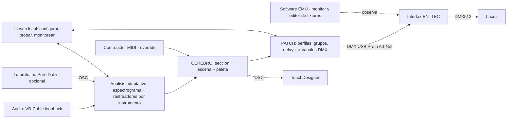

# AVI — Plan del MVP

**AVI** = un solo "cerebro" que escucha la música, rastrea cada instrumento en el
espectro de forma adaptativa y decide, autónomamente, qué hacen las luces
(DMX directo a tu interfaz ENTTEC) y qué hacen los visuales (TouchDesigner, con su
propio conmutador de clips: nuestro "mini Resolume"), con los mismos colores y el mismo pulso.

> Versión 3 (2026-09-23). Cambio respecto a v2: "EMU" resultó ser el **software**
> gratuito de ENTTEC, no una caja MIDI → DMX. AVI manda DMX directo al hardware ENTTEC
> desde Python; EMU queda como monitor y editor de fixtures. Detalle en
> `docs/hardware/emu_y_luces.md`.

---

## 1. Qué cuenta como "MVP terminado"

El MVP está hecho cuando, con una canción sonando en tu Mac:

1. Las luces reaccionan por instrumento (bombo, bajo, voces, snare, hats) a través de tu interfaz ENTTEC.
2. TouchDesigner muestra **3 escenas** que reaccionan a los mismos instrumentos.
3. Luces y visuales usan **la misma paleta de color** en todo momento.
4. El cerebro **cambia de escena y paleta solo** cuando la canción cambia de sección
   (intro → build → drop → break), alineado al compás.
5. Tu hardware se configura y se verifica desde una **UI local** (dispositivos, canales,
   grupos, delays) sin tocar código, y un controlador MIDI puede **forzar** escena /
   paleta / blackout.

Latencia objetivo audio → luz: **< 50 ms** percibidos.

> Supuesto: "que actúe como el DJ" = reaccionar y dirigir el show sobre la música
> que ya suena. Elegir o mezclar canciones queda fuera del MVP (ver §10).

---

## 2. Decisiones tomadas

| Decisión | Elegido | Por qué |
|---|---|---|
| Lenguaje del cerebro | **Python 3.11** | Se puede escribir y **probar en cloud** con audio sintético; librerías maduras para DMX (`pyserial`, Art-Net por UDP), MIDI (`mido`), OSC (`python-osc`) y UI web (`fastapi`). Un patch de Pd no se puede testear aquí. |
| Tu prototipo Pure Data | **Entrada opcional** | Si quieres reutilizarlo, que mande OSC al cerebro (`/pd/band/*`). Ver `puredata/README.md`. |
| Análisis de audio | **Rastreadores adaptativos** sobre espectrograma (`numpy`) | Los filtros no son fijos: cada instrumento se busca y se sigue en lo que suena (§4). |
| Hardware de luces | **Capa de patch** independiente del cerebro + UI web local | Cualquier luz/interfaz se describe en perfiles; se verifica y ajusta desde la UI (§5). |
| Salida a luces | **DMX directo** desde Python a la interfaz ENTTEC: `enttec_pro` (DMX USB Pro por USB) o `artnet` (nodo de red) | EMU es software; su control MIDI es de pago y solo dispara escenas guardadas. DMX directo da los 256 valores por canal y ~40 cuadros/s. Ya implementado con tests en `avi/outputs/dmx.py` (PR #3). |
| Software EMU | **Auxiliar**: monitor DMX/Art-Net, editor de fixtures (importa GDTF), plan B con su Sound Tracker | Gratis y ya lo tienes; no está en el camino crítico. |
| Salida a TouchDesigner | **OSC** (+ MIDI espejo) | OSC lleva floats 0–1 con nombre, más preciso que MIDI (0–127). El MIDI espejo queda para rekordbox / software de VJ. |
| Resolume | **Fuera del proyecto** | Arena está instalado pero sin licencia y no hay Resolume libre. TouchDesigner hace el trabajo: en F5 el script de TD incluye un conmutador de escenas y un reproductor de clips propios (nuestro "mini Resolume"). |
| Red de TouchDesigner | Generada por **script Python** que corres dentro de TD | Un `.toe` es binario; un script se versiona y se escribe en cloud. |

---

## 3. Arquitectura



**La clave del "un solo cerebro":** cada ~10 ms el cerebro produce un único
`ShowState`. Luces y TouchDesigner solo *traducen* ese estado; ninguno
decide nada por su cuenta. Así es imposible que se desincronicen los colores.

```json
{
  "t": 123.456,
  "bpm": 126.0, "beat": 3, "bar": 17, "phrase_pos": 0.25,
  "section": "drop",
  "scene": 2,
  "palette": [[1.0, 0.1, 0.4], [0.1, 0.3, 1.0], [1.0, 1.0, 1.0]],
  "instruments": {
    "kick":  { "level": 0.95, "onset": true,  "hz": [48, 130],    "confidence": 0.9 },
    "bass":  { "level": 0.40, "onset": false, "hz": [70, 310],    "confidence": 0.7 },
    "voice": { "level": 0.30, "onset": false, "hz": [420, 2600],  "confidence": 0.5 },
    "snare": { "level": 0.20, "onset": false, "hz": [1800, 5500], "confidence": 0.8 },
    "hats":  { "level": 0.60, "onset": true,  "hz": [7000, 15000],"confidence": 0.8 },
    "sub":   { "level": 0.80, "onset": false, "hz": [25, 55],     "confidence": 0.9 }
  },
  "override": null
}
```

Módulos (una carpeta por fase, ver `avi/`):

| Módulo | Hace | Fase |
|---|---|---|
| `avi/audio` | **hecho**: espectrograma, rastreadores adaptativos, onsets, BPM (`Analyzer.process(bloque) → AnalysisFrame`) | F1 |
| `avi/brain` | Detecta sección, elige escena y paleta, produce `ShowState` | F2 |
| `avi/patch` | Perfiles de luces, fixtures, grupos con delay → valores por canal | F3 |
| `avi/outputs` | `dmx.py` (**hecho**: `EnttecProBackend`, `ArtNetBackend`, `NullBackend`); `ShowState` → patch → DMX; `ShowState` → OSC (TD) | F3 |
| `avi/ui` | UI web local para configurar hardware, probar canales y monitorear | F4 |
| `avi/control` | Controlador MIDI de entrada → overrides | F5 |
| `touchdesigner/` | Script que construye la red de TD (escenas + reproductor de clips) | F5 |
| `avi/cli.py` | **hecho**: `avi synth`, `avi analyze`, `avi live` | F1 |
| `scripts/` | **hecho**: `dmx_probe.py` (barrido de canales), `audio_probe.py` (bandas del loopback) | L1/L2 |

---

## 4. Análisis adaptativo: rastreadores por instrumento

Los filtros **no son bandas fijas**. Cada instrumento tiene un *rastreador* que mira el
espectrograma, decide dónde está "su" instrumento en lo que suena ahora, y se
reajusta continuamente.

Cómo funciona cada rastreador:

1. **Punto de partida**: un rango nominal (p. ej. bombo 60–150 Hz) dentro de un rango
   de búsqueda más amplio (40–200 Hz) y un carácter: *transitorio* (bombo, snare, hats)
   o *sostenido/tonal* (sub, bajo, voz).
2. **Huella espectral**: el rastreador guarda la forma del espectro en los momentos en
   que su instrumento domina (en los golpes, para los transitorios; en los frames
   estables, para los tonales) y la actualiza con una constante de tiempo de 2–8 s.
3. **Máscara suave**: en cada frame, la energía de cada bin del espectro se reparte
   entre los rastreadores en proporción a sus huellas (tipo Wiener). El nivel del
   instrumento es la energía que le tocó, no la de una banda fija. Así el bombo y el
   bajo dejan de "contaminarse" aunque compartan frecuencias.
4. **Reajuste del filtro**: el centro y el ancho de la huella se mueven despacio hacia
   la región de más energía dentro del rango de búsqueda, con histéresis; nunca salen
   del rango de búsqueda.
5. **Confianza**: si la huella es débil o ambigua, el rastreador vuelve al rango nominal
   y baja su `confidence`. La UI (§5) y el `ShowState` muestran el rango actual de cada
   rastreador para que veas qué está capturando.

| Instrumento | Nominal | Búsqueda | Carácter | Luces (DMX) | TouchDesigner |
|---|---|---|---|---|---|
| `sub` | 20–60 Hz | 20–90 Hz | tonal | Dimmer base de todas (respira) | Escala / deformación lenta |
| `kick` | 60–150 Hz | 40–200 Hz | transitorio | Flash de dimmer en grupo frontal | Pulso de zoom + feedback |
| `bass` | 150–400 Hz | 60–500 Hz | tonal | Desplaza el tono dentro de la paleta | Amplitud del ruido / desplazamiento |
| `voice` | 400–2k Hz | 250–4k Hz | sostenido | Canal blanco (W) / intensidad secundaria | Brillo, densidad de partículas |
| `snare` | 2–6 kHz | 1–8 kHz | transitorio | Strobe corto (solo en `drop`) | Glitch / corte de cámara |
| `hats` | 6–16 kHz | 4–18 kHz | transitorio | Chase con delay entre luces | Chispas, velocidad de partículas |

**Color compartido:** el cerebro tiene una paleta de 3 colores.
- Luces RGB = `paleta[i] × nivel de su instrumento`.
- TouchDesigner recibe los mismos RGB por `/avi/color/1..3` → los usa en sus Ramp/Constant TOP.

Post-MVP: pre-analizar canciones con Demucs (stems offline) para entrenar las huellas
con instrumentos reales.

---

## 5. Capa de hardware: patch, grupos, delays y UI

Para que AVI funcione con **cualquier** luz o interfaz que aparezca, el cerebro nunca
habla de canales DMX; habla de *intenciones* (`dimmer`, `color`, `strobe`, `white`)
sobre *grupos*. La capa de patch traduce eso a canales según la configuración.

**Modelo de datos** (`config/fixtures.yaml`, editable desde la UI):

| Nivel | Qué describe | Ejemplo |
|---|---|---|
| **Output** | Cómo salen los bytes DMX | `enttec_pro` (DMX USB Pro por USB), `artnet` (nodo de red), `null` (tests); futuros: sACN, más universos |
| **Perfil** | Qué hace cada canal de un modelo de luz | PAR RGBW 8ch: dimmer=1, R=2, G=3, B=4, W=5, strobe=6 … |
| **Fixture** | Una luz concreta | `par_1`: perfil `par_rgbw_8ch`, dirección 1, output `enttec_pro` |
| **Grupo** | Conjunto de fixtures con orden y **delay** | `back`: [par_3, par_4], delay 60 ms por luz → efecto de ola |

Perfiles: se escriben a mano en la UI o se **importan de Open Fixture Library**
(open-fixture-library.org, JSON abierto con miles de luces, incluidas genéricas chinas;
también exporta GDTF, que el software EMU lee).

**Grupos con delay**: cada grupo tiene `delay_ms` (o `delay_beats`) y `order`
(`left_to_right`, `center_out`, `random`). Un efecto (flash, chase, color) lanzado al
grupo se aplica a cada fixture con `delay × posición`. Así salen olas, barridos y chases
sin programar nada por luz.

**UI web local** (`avi ui` → `http://localhost:8080`, fase F4), cinco pestañas:

1. **Dispositivos**: interfaz DMX detectada (puerto serie o nodo Art-Net), puertos MIDI, prueba de conexión.
2. **Perfiles**: crear/editar canales de un modelo, importar de Open Fixture Library.
3. **Patch**: asignar dirección y perfil a cada fixture, armar grupos, definir delays.
4. **Probar**: slider por canal, botón *Identificar* (parpadea la luz), enviar un color
   y confirmar que llega el correcto; corrige el perfil ahí mismo si no.
5. **Monitor**: espectrograma en vivo con el rango actual de cada rastreador, niveles
   por instrumento, sección/escena, valores DMX y mensajes OSC saliendo.

Todo lo que se toca en la UI se guarda en `config/*.yaml` (versionable en git).

---

## 6. Motor de escenas (el "DJ de luces")

Máquina de estados simple y predecible:

| Sección | Cómo se detecta | Qué hace |
|---|---|---|
| `calm` | Energía corta ≈ larga, poco bombo | Paleta fría, movimientos lentos, sin strobe |
| `build` | Nivel de `hats` y `snare` subiendo durante ≥ 4 compases | Acelera chase, sube intensidad, prepara cambio |
| `drop` | Salto de energía total + bombo denso tras un `build` o `break` | Cambia escena + paleta, strobe habilitado |
| `break` | Bombo desaparece ≥ 2 compases | Baja dimmer, visual ambiental |

Reglas anti-caos:
1. Los cambios de escena se **cuantizan** al inicio de frase (cada 16 beats) salvo el `drop`, que entra en el beat 1.
2. **Histéresis**: una sección debe sostenerse ≥ 2 compases para contar.
3. **Duración mínima** por escena: 8 compases.
4. Override del controlador MIDI siempre gana hasta que lo sueltes.

---

## 7. Protocolos y puertos (contrato entre módulos)

**DMX → interfaz ENTTEC** (`avi/outputs/dmx.py`, ya implementado)

| Backend | Cómo | Config en `config/local.yaml → dmx:` |
|---|---|---|
| `enttec_pro` | Puerto serie `/dev/tty.usbserial-EN*`, protocolo del widget DMX USB Pro (label 6), ~40 cuadros/s | `backend: enttec_pro`, `serial_port` |
| `artnet` | UDP 6454, paquetes ArtDmx, universo 0 | `backend: artnet`, `host`, `universe` |
| `null` | No envía nada; para tests y `--dry-run` | `backend: null` |

Cuál de los dos usa tu interfaz se confirma en L2 con `python scripts/dmx_probe.py --list`.

**OSC → TouchDesigner** (UDP `127.0.0.1:9000`)

| Dirección | Tipo | Rango |
|---|---|---|
| `/avi/inst/{sub,kick,bass,voice,snare,hats}` | float | 0–1 |
| `/avi/onset/{instrumento}` | int | 1 en el golpe |
| `/avi/bpm` · `/avi/beat` · `/avi/bar` | float · int · int | — |
| `/avi/color/{1,2,3}` | float r g b | 0–1 |
| `/avi/scene` | int | 0..N-1 |
| `/avi/section` | string | calm/build/drop/break |
| `/avi/clip` | int | índice de clip propio en TD (mini Resolume) |

**MIDI espejo** (puerto virtual `Driver IAC Bus 1`, para TD / rekordbox)
- Canal 1, CC 1–6 = instrumentos; notas 36–41 = onsets; Program Change = escena.

**MIDI de entrada** (tu controlador → `Driver IAC Bus 2` o el puerto del controlador)
- Pads 1–8 = forzar escena; knob 1 = paleta; botón = blackout; botón = "auto" (suelta override).

---

## 8. Fases, en orden

Cloud = lo hago yo aquí con PRs. Local = lo hago yo en tu Mac por Remote Control
(hilo "Setup local AVI en Mac"); los prompts en `docs/prompts_llm_local/` quedan de
respaldo para tu LLM local.

### Bloque A — Arranque
1. **Cloud · F0** — Plan + esqueleto + configs de ejemplo. **Hecho** (PR #2, v3 en este PR).
2. **Local · L1** — Entorno en tu Mac. **Hecho** (PR #3): Python 3.11, VB-Cable como
   loopback, buses IAC 1 y 2 como puertos MIDI, Pd 0.52, rekordbox 6, Arena sin licencia (no se usa),
   TouchDesigner instalándose. Todo en `config/local.yaml`.
3. **Local · L2** — Identificar la interfaz ENTTEC (`dmx_probe.py --list`), barrer canales
   de cada luz (`--sweep`) y escribir `config/fixtures.yaml`. **Esperando** que aparezcan la
   interfaz y las luces.

### Bloque B — Cerebro (cloud)
1. **F1 · Análisis adaptativo** — **Hecho** (PR F1): `avi/audio/` con espectrograma, rastreadores con huella espectral y máscara suave, onsets por instrumento, BPM/compás; `avi synth` (canción de juguete), `avi analyze` (timeline JSON) y `avi live` (loopback). 11 tests: bombo y bajo superpuestos se separan, el bajo a 90 Hz baja el rango del rastreador, BPM 126 ± 3.
2. **F2 · Cerebro** — Secciones, escenas, paleta, `ShowState` + tests.
3. **F3 · Patch + salidas** — Perfiles, fixtures, grupos con delay sobre `dmx.py` (ya hecho), OSC a TD, modo `--dry-run` con `NullBackend`.
4. **F4 · UI web de hardware** — Dispositivos, perfiles (importa Open Fixture Library), patch, probar/identificar, monitor en vivo. Testeada en cloud con `NullBackend`.
5. **F5 · Control + TouchDesigner** — Controlador MIDI de entrada con overrides, y script que construye la red de TD: OSC In → 3 escenas generativas + reproductor de clips propios (Movie File In por `/avi/clip`) → Switch. Ese reproductor es nuestro "mini Resolume".

### Bloque C — En vivo (local, en tu Mac)
1. **L3** — Correr el analizador con una canción real desde rekordbox → VB-Cable y ver en el monitor qué captura cada rastreador; ajustar rangos de búsqueda (después de F1).
2. **L4** — Configurar tu hardware en la UI, verificar cada luz con *Identificar*, construir la red de TD con el script y prueba integrada audio → luces + visuales (después de F3, F4 y F5).
3. **L5** — Cargar tus clips propios en la carpeta `touchdesigner/clips/` y asignarlos a escenas en `config/show.yaml`.

Cada fase cloud = 1 PR con tests verdes. Cada fase local termina con push a una rama
`local/...` para que la siguiente fase cloud lo tome sin que copies nada a mano.

---

## 9. Riesgos y supuestos

| Riesgo | Mitigación |
|---|---|
| Los rastreadores adaptativos se "roban" el instrumento del vecino | Máscara normalizada (la energía de un bin se reparte, no se duplica), rangos de búsqueda acotados, vuelta al nominal si baja la confianza; tests con mezclas sintéticas |
| No sabemos aún qué interfaz ENTTEC es (USB Pro, Mk2, EMU Hardware Interface, nodo Art-Net) | `dmx.py` ya cubre serie y Art-Net; `dmx_probe.py --list` lo detecta en L2. Si es la EMU Hardware Interface por USB-C y no expone puerto serie, se usa su salida Ethernet (Art-Net) |
| Las luces chinas varían en canales (3, 4, 7, 8 ch) | Perfiles por modelo, importables de Open Fixture Library o editables en la UI; `dmx_probe.py --sweep` los descubre |
| El loopback VB-Cable añade latencia o se desconfigura | Buffer de 512 muestras @ 48 kHz ≈ 11 ms; L3 mide la latencia real; `audio_probe.py` verifica que llega señal |
| TouchDesigner gratis limita a 1280×1280 | Suficiente para MVP |

---

## 10. Después del MVP

- Pre-análisis por stems (Demucs) para entrenar las huellas con instrumentos reales.
- Aprender tus preferencias: guardar overrides y usarlos para ajustar reglas.
- DMX de 16 bits (canales fine) y varios universos (sACN) en la misma capa de patch.
- Integración con rekordbox (MIDI clock o Ableton Link) para BPM exacto y cue points.
- Editor visual de escenas y efectos en la misma UI web.
